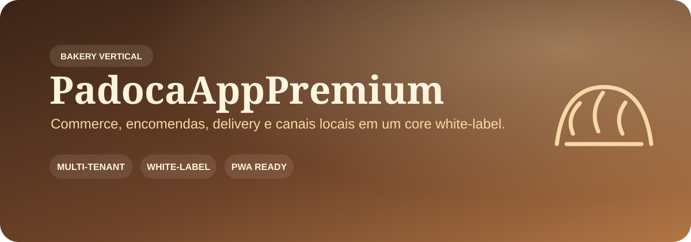
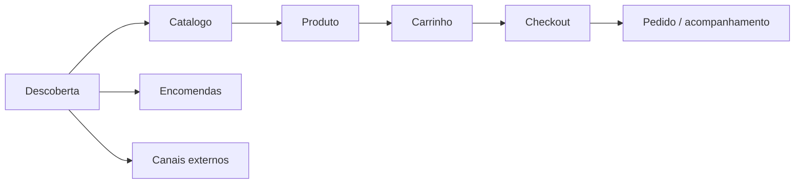

<p align="center">
  
</p>

<p align="center">
  
  
  
</p>

# PadocaAppPremium

Plataforma premium para padarias e negócios locais, desenhada como **core white-label** com tenant de demonstração e preparada para migração para o **Tupiniquim Vertical SaaS**.

> **Novo cliente = novo tenant + configuração.** Marca, catálogo, canais, horários, contatos, módulos e integrações variam por cliente sem duplicar o core.

## ✨ Visão do produto

| 🥖 Catálogo & produtos | 🛒 Carrinho & checkout | 🚚 Delivery & retirada | 🎂 Encomendas |
| --- | --- | --- | --- |
| Categorias, variações, adicionais, promoções e disponibilidade | Estado persistido, totalização e jornada de compra | Frete, retirada por unidade e hub de canais | Fluxos customizados para pedidos especiais e produção |

| 📱 PWA | 📍 SEO local | 🎨 White-label | 📊 Analytics-ready |
| --- | --- | --- | --- |
| Manifest, service worker e experiência instalável | Sitemap, metadata, JSON-LD e presença local | Logo, paleta, tipografia, mídia, contatos e conteúdo por tenant | Eventos de produto, checkout, compra e canais externos |

## 🧩 Arquitetura do vertical

```text
src/
  business/      -> dados do tenant, produtos e contratos
  core/          -> store, theme, utilitários e regras compartilhadas
  components/    -> UI agnóstica orientada por configuração
  scenes/        -> experiências visuais/3D substituíveis por segmento
  pages/         -> jornadas comerciais e operacionais
```

Separação central: **CORE · THEME · BUSINESS DATA · PRODUCT DATA · INTEGRATIONS · CONTENT**.

## 🎛️ White-label de verdade

Para criar uma nova padaria ou adaptar o produto para outro negócio local, a intenção é alterar **configuração**, não componentes centrais:

- nome, logo, slogan, anúncios e CTAs;
- paleta e preset visual;
- fotos, hero e mídia editorial;
- produtos, categorias, preços e promoções;
- endereço, horários e unidades;
- WhatsApp e canais de delivery;
- módulos habilitados: commerce, delivery, pickup, custom orders, booking, loyalty;
- conteúdo e ordem das seções da home.

## 🧭 Jornada comercial



## 🔐 Segurança e qualidade

- secrets não entram no Git nem no frontend;
- autenticação/autorização sensível deve ser validada no servidor quando o backend estiver ativo;
- dados demo e dados reais permanecem separados;
- `/admin` não deve ser indexado nem expor configuração sensível;
- CI possui quality gates e CodeQL; Dependabot está versionado;
- acessibilidade, reduced-motion, estados de erro/vazio/offline e performance fazem parte do baseline;
- ausência de backend multi-tenant validado impede declarar o vertical como production-ready SaaS.

## 📚 Documentação

- [Planejamento mestre do Tupiniquim Vertical SaaS](docs/PLANEJAMENTO_MESTRE_TUPINIQUIM_VERTICAL_SAAS.md)
- [Auditoria Tupiniquim Toolbox](docs/TOOLBOX_AUDIT_2026-09-10.md)
- [Política de segurança](SECURITY.md)
- [Monorepo canônico — Sistema SaaS Geral](https://github.com/tupiniquimtechsolution-blip/Sistema-SaaS-Geral)

## 🚦 Estado real

O produto já possui um baseline white-label funcional no frontend e uma separação clara entre core e dados do negócio. A próxima etapa SaaS é conectar esse vertical ao núcleo compartilhado de tenancy, identidade/RBAC, persistência server-side, Brand Studio, planos/entitlements, auditoria e observabilidade sem perder a experiência premium atual.
